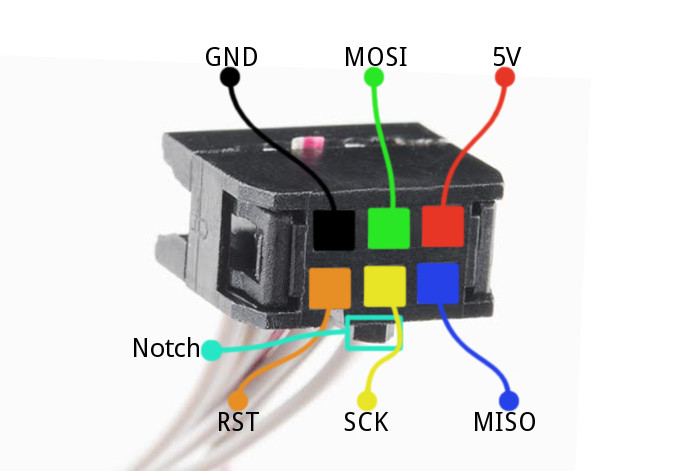
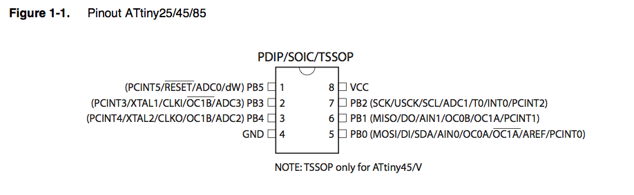

# Programming an AVR Microcontroller

> Some notes on programming an AVR microcontroller using an ISP programmer, like the Sparkfun Pocket AVR Programmer. I'm using the ATTiny85 in this document, but this should work generally.

## 2x3 ISP Cable



## ATTiny85 Pinout



## Connecting

ISP | Chip
--- | ----
Blue (MISO) | 6 (MISO)
Red (5V) | 8 (VCC)
Yellow (SCK) | 7 (SCK)
Green (MOSI) | 5 (MOSI)
Orange (RST) | 1 (RESET)
Black (GND) | 4 (GND)

## Compiling

1. Write your program in a file named `main.c`

1. Compile `main.c` to `main.o`

    ```
    $ avr-gcc -Os -mmcu=attiny85 -o main.o -c main.c
    ```

1.    Compile `main.o` to `main.elf`

    ```
    $ avr-gcc -mmcu=attiny85 -o main.elf main.o
    ```

1.    Compile `main.elf` to `main.hex`

    ```
    $ avr-objcopy -j .text -j .data -O ihex main.elf main.hex
    ```

## Uploading

1. Compile your program to `main.hex`

1. Connect your AVR Programmer to your chip

1. Upload `main.hex` to the chip (i.e. flash it)

    ```
    $ avrdude -P usb -p t85 -c usbtiny -e -U flash:w:main.hex
    ```

## Fuses

You can check your fuse settings [here](http://www.engbedded.com/fusecalc/). The default, safe ones for the ATTiny85 are: `(E:FF, H:DF, L:62)`

1. Connect your AVR Programmer to your chip

1. Set the fuses

    ```
    $ avrdude -P usb -p t85 -c usbtiny -e -U lfuse:w:0x62:m -U hfuse:w:0xdf:m -U efuse:w:0xff:m
    ```

## Resources

* [Fuse Calculator](http://www.engbedded.com/fusecalc/)
* [Sparkfun Pocket AVR Programmer](https://www.sparkfun.com/products/9825)
* [Sparkfun programmer board overview](https://learn.sparkfun.com/tutorials/pocket-avr-programmer-hookup-guide/board-overview)
* [Some good images and diagrams of ISP pins](https://learn.sparkfun.com/tutorials/installing-a-bootloader-on-the-microview/wiring-the-programmer)
* [Setting up avrdude and avr-libc on Mac OSX](http://maxembedded.com/2015/06/setting-up-avr-gcc-toolchain-on-linux-and-mac-os-x/)
* [Good sample code and instructinos](http://www.instructables.com/id/Honey-I-Shrunk-the-Arduino-Moving-from-Arduino-t/?ALLSTEPS)
* [C constants for ATTinys](https://github.com/vancegroup-mirrors/avr-libc/blob/master/avr-libc/include/avr/iotnx5.h)
* [Another general example](http://www.meoworkshop.org/how-to-avr-with-osx/)
